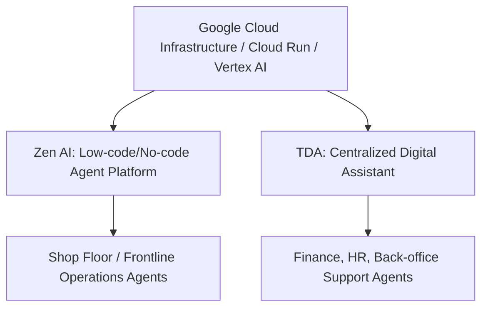

# 🏭 [Deep Dive] Tata Steel: Google Cloud 기반 Agentic AI 도입 및 백오피스 혁신

> **작성자:** Gemini (Antigravity) 에이전트  
> **최종 수정일:** 2026-08-07  
> **핵심 키워드:** `Agentic AI`, `Autonomous Fleet`, `Zen AI`, `Tata Steel Digital Assistant (TDA)`, `Google Cloud Run`, `Vertex AI`

---

## 1. 개요 및 배경 (Executive Summary)

* **대상 기업:** Tata Steel (글로벌 선도 철강 제조 기업)
* **협력 파트너:** Google Cloud
* **도입 성과:** 단 **9개월 만에 300개 이상의 전문 자율형 AI 에이전트(Autonomous AI Agents)**를 전사에 성공적으로 구축 및 배포.
* **주요 요점:** 단순한 기술 검증(PoC) 수준을 넘어, 현업 직원이 스스로 에이전트를 조립·생산할 수 있는 **전사 플랫폼화(Democratization)**에 성공하여 대규모 생산성 혁신을 달성함.

---

## 2. 기술 아키텍처 및 핵심 플랫폼 (Technology Stack)

Tata Steel의 Agentic AI 아키텍처는 Google Cloud의 인프라 위에 자체 개발한 두 가지 핵심 독자 플랫폼을 얹은 구조입니다.

### ① Zen AI (Low-code/No-code 에이전트 제작 플랫폼)
* **역할:** 코딩 지식이 없는 일반 현업 관리자, 개발자, 실무진이 빠르게 맞춤형 AI 에이전트를 직접 빌드, 테스트, 배포할 수 있도록 지원하는 사내 샌드박스 플랫폼.
* **기술 백엔드:** Google Cloud Run(서버less 컨테이너 환경)을 기반으로 하여 데이터 트래픽 스파이크 발생 시 즉각적으로 유연하게 확장되고, 미사용 시 자원을 Zero로 줄여 비용 효율성을 확보.
* **데이터 연계:** 정형 데이터(ERP 실적 등)와 비정형 콘텐츠(매뉴얼, 규정, 동영상 가이드 등)를 모두 임베딩하여 연결.

### ② Tata Steel Digital Assistant (TDA)
* **역할:** 사내에 흩어진 정보 사일로(Silo)를 제거하기 위한 중앙 통제 및 의사결정 보조 시스템.
* **특징:** 전 세계 공개 데이터(뉴스, 원자재 가격 정보 등)와 사내 운영 이력, 부서별 지식을 통합 분석하여 직원들에게 실시간 시나리오별 통찰(Insight)을 제공.

---

## 3. 핵심 비즈니스 유스케이스 (Core Use Cases)

300여 개의 자율형 에이전트 군단은 부서별로 특화된 반복 작업과 고부가가치 판단 작업을 동시에 처리하고 있습니다.

### ① 인사·총무 (Human Resources)
* **기존 업무:** 매월 수천 건에 달하는 임직원의 규정, 복리후생, 휴가, 노무 제도 관련 routine 질의응답 및 지원 요청 처리로 리소스 낭비 심각.
* **AI의 역할:** **TDA 기반의 HR Support Agent**가 직원들의 자연어 질문을 해석하고 규정집을 검색하여 즉각적인 답변 제공 및 일부 자동 신청 프로세스 연계.
* **성과:** **단독으로 전사 HR 티켓의 70% 이상을 휴먼 개입 없이 완결.**

### ② 고객 서비스 및 백오피스 (Customer Service & Back-office)
* **기존 업무:** 고객 컴플레인 유입 시 수작업으로 담당자 지정, 이력 대조, 분석 후 보고서를 작성하여 대응 프로세스가 지연됨.
* **AI의 역할:** 전용 컴플레인 분석 에이전트가 고객 인입 메시지를 인지한 뒤, 과거 사례를 대조하여 해결책 제안서 초안 및 관련 데이터를 수집해 대응팀에 즉시 배달.
* **성과:** **고객 서비스 리드타임 최대 50% 단축.**

### ③ 재무·회계 (Finance & Accounting)
* **기존 업무:** 방대한 양의 구매 인보이스 수작업 분류, 각 지역/국가별 세금(GST) 공제 여부 검토 및 분류 오류로 인한 세무 재작업 발생.
* **AI의 역할:** 인보이스 분류 에이전트 및 세금 자동 분류 에이전트가 데이터 정합성을 비교하고 위험 요소를 사전에 스크리닝.

### ④ 현장 안전 및 예측 정비 (Shop Floor Safety & Asset Maintenance)
* **기존 업무:** CCTV 화면 수동 관제, 설비 센서 알람 사후 대응.
* **AI의 역할:** *Safety EyeQ* 시각 에이전트가 작업 현장 위험 요소 실시간 탐지 및 경고 발송. 자산 예측 정비 에이전트가 이상 진동/온도 감지 시 정비 오더 초안 생성.

---

## 4. 정량적 비즈니스 효과 (Business Impact)

| 지표 유형 | 도입 전 (Before) | 도입 후 (After) | 개선 효과 및 ROI |
|---|---|---|---|
| **HR 티켓 처리** | 직원 및 지원팀이 수동 분류/처리 | **70% 이상 AI 자율 처리** | 수천 명의 HR 리소스 절감 및 응답 대기 시간 98% 단축 |
| **고객 응대 속도** | 평균 2~3일 소요 (이력 검토 등) | **처리 시간 50% 단축** | 고객 이탈 방지 및 영업 대응 품질 극대화 |
| **인프라 운영 비용** | 피크 타임 대비 상시 고정 비용 발생 | **Google Cloud Run 서버리스 운영** | 데이터 스파이크 유연 대응 및 유휴 리소스 비용 0원 달성 |

---

## 5. 세아제강에 대한 적용 시사점 (Key Takeaways)

1. **"Ask AI"에서 "Delegate to AI"로의 전환 (L2 → L4):**
   * 단순한 사내 지식 검색(L2)에 머무르지 않고, AI가 인보이스를 직접 검증 및 분류하여 결과를 시스템에 반영하거나 HR 티켓을 끝까지 처리하는 "위임형 워크플로우(L4)"를 세아제강 영업 및 구매 시스템에 도입해야 합니다.
2. **현업 주도형 로우코드 생태계 조성 (Zen AI 모델):**
   * AI TF팀이 모든 부서의 요청을 개발해 주는 방식은 병목이 생깁니다. 현업의 영업 관리자나 재무 담당자가 템플릿을 선택하여 자신만의 "단순 비교/추적 에이전트"를 조립할 수 있는 환경(예: MS Copilot Studio나 Low-code 툴셋)을 열어주어야 속도감 있는 전사 확산이 가능합니다.
3. **비정형 데이터의 데이터 자산화:**
   * Tata Steel 사례의 핵심은 규정집 PDF, 기존 수작업 계약 문서, 심지어 동영상 매뉴얼까지 AI가 즉시 이해할 수 있도록 Google Cloud 인프라상에서 벡터화해 둔 것입니다. 세아제강 내에 산재한 견적서, 사내 규정 파일들의 데이터 허브화가 선행되어야 합니다.
