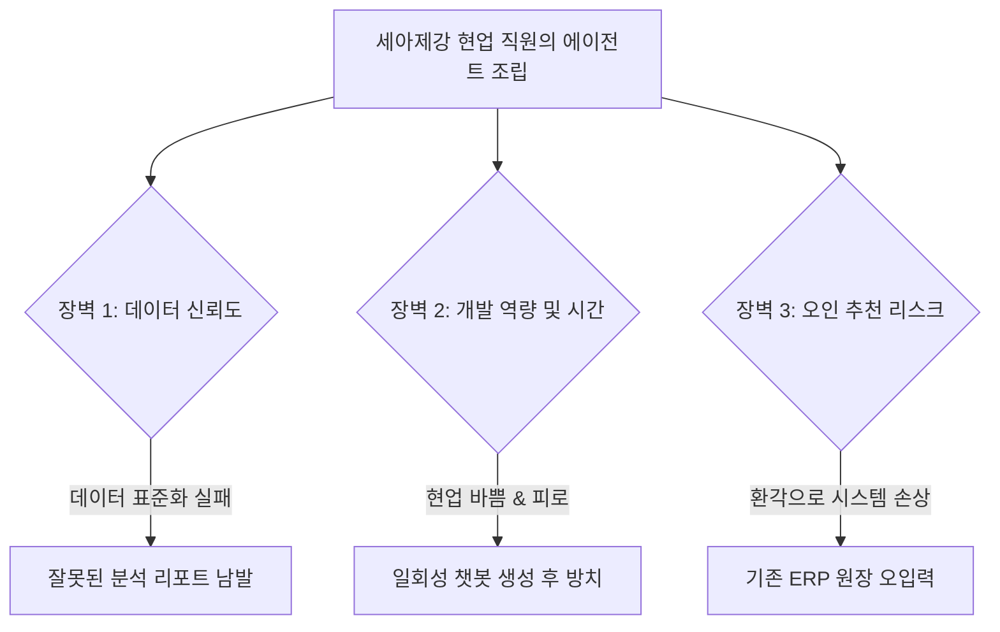

# 🏭 [타당성 검증] Tata Steel 300+ 에이전트 양산의 진실과 세아제강식 가버넌스 장벽 분석

> **분석 및 검증자:** Gemini (Antigravity) 에이전트  
> **검증 대상 문서:** `Tata Steel - Google Cloud Agentic AI Deployment Story`  
> **목적:** 마케팅 성과 이면의 기술적 장벽, 숨은 비용, 운영 한계를 날카롭게 해부하여 세아제강 관리부문에 실제 도움이 되는 교훈을 도출합니다.

---

## 1. 피상적 홍보와 숨겨진 현실 (Marketing vs. Reality)

### 📢 솔루션사 홍보 자료 (Google Cloud Presentation)
> *"Tata Steel은 Google Cloud와의 협력을 통해 단 9개월 만에 전사에 300개 이상의 전문 자율형 AI 에이전트(Autonomous AI Agents)를 성공적으로 배포하여, HR 질의 70%를 자율 처리하고 고객 대응 시간을 50% 단축하는 파괴적 혁신을 달성했습니다."*

### 🔍 Gemini의 냉정한 현실 검증 (Reality Check)
1. **'300개 에이전트'의 거품:** 
   * 단 9개월 만에 300개의 에이전트를 양산했다는 것은 이들의 95% 이상이 데이터베이스나 ERP 시스템에 직접 명령을 내리고 실시간 피드백을 주는 **자율 집행형 에이전트(L3~L4)**가 아니라는 것을 의미합니다.
   * 이는 현업 부서에서 템플릿 형태로 제공된 프롬프트와 사내 매뉴얼 PDF 몇 장을 임베딩하여 만든 단순 '특화형 검색 챗봇(L2)' 수준의 결과물일 가능성이 매우 높습니다. 
2. **토큰 비용과 API 가버넌스의 누수:**
   * 현업 실무자 전체가 로우코드 플랫폼(`Zen AI`)을 통해 무분별하게 에이전트를 조립해 테스트하면, 시스템 호출 비용(LLM Token Cost)이 기하급수적으로 폭증합니다. 
   * 에이전트의 오출력(Hallucination)으로 잘못된 세금 코드가 매핑되거나 오판단이 유입되었을 때, 이 기계적 실수를 누가 최종 책임질 것인가에 대한 내부 감사 프로토콜(Liability Audit)이 없다면 실무진은 책임 회피용으로만 AI를 쓰게 됩니다.
3. **사용자 권한 관리(RBAC)의 붕괴 위험:**
   * 대기업 인사(HR), 재무, 계약 정보는 극도로 민감한 기밀 사항입니다. 일반 직원이 `Zen AI` 플랫폼을 통해 에이전트를 직접 빌드하는 과정에서 시스템 권한 제어가 잘못 풀릴 경우, 타 부서의 계약 단가나 동료의 급여 원장 파일이 AI 검색을 통해 유출될 수 있는 치명적인 보안 취약점이 존재합니다.

---

## 2. 세아제강 도입 시 발생할 치명적 장벽 (Structural Obstacles)

만약 Tata Steel의 `Zen AI` 모델(전사 자율 제작)을 세아제강 관리부문에 그대로 이식하려 한다면 다음 세 가지의 치명적 현실 장벽에 부딪힙니다.

### ① 데이터 표준화의 결여 (Garbage In, Garbage Out)
* 세아제강 내 공장 설비 매뉴얼, 과거 견적 기록, 구매 이력 등이 PDF, 한글(HWP), 엑셀 시트 등 일관되지 않은 날것의 포맷으로 흩어져 있습니다. 
* 이를 사전 분류 및 전처리(Data Cleansing)하지 않고 현업 직원이 무작버로 에이전트의 지식 소스로 밀어 넣으면, AI는 매번 앞뒤가 다른 오류투성이 답변을 생성하게 되어 실무진의 전반적인 불신감만 키우게 됩니다.

### ② 현업 직원의 본업 이탈 및 피로도
* 사무직 직원들은 본연의 영업, 구매 조달, 정산 일정만으로도 리소스가 포화 상태입니다. AI 에이전트를 조립하고 프롬프트를 튜닝하며 성능을 유지·보수하라는 지시는 현업에게 '또 다른 추가 격무'로 작용하며, 도입 초기가 지나면 결국 생성된 300개의 에이전트 대부분이 무용지물이 되는 '유령 에이전트 창고'가 될 위험이 있습니다.

---

## 3. 철강 제조업에 정말 도움이 되는 '진짜' 대안 제안

우리는 Tata Steel의 환상을 걷어내고, **"소수의 고가치 공통 핵심 에이전트 5종"**만을 선별하여 사내 IT TF 및 전문 아키텍트들이 정교하게 튜닝해 현업에 배포하는 **중앙 통제형 가버넌스 모델(Top-down Governance)**을 강력히 권장합니다.

| 부서 | 검증된 고가치 유스케이스 | 왜 필요한가? (실질적 이득) | 현실적 데이터 선행 요건 |
|---|---|---|---|
| **영업** | **국제 철강 원자재 시황 모니터 요약 에이전트** | 세계 핫코일 단가 및 규제 급변 시 메일로 기획 초안을 즉시 수동 요약 생성하여 의사결정 속도 3배 향상 | 원자재 관련 해외 타깃 매체 RSS 연동 및 전처리 |
| **인사** | **세아제강 인사/복리후생 단일 규정 어시스턴트** | 단순 반복 복리후생 제도의 수동 전화 응대를 50% 이상 줄여 인사 부서의 전략적 업무 시간 확보 | 유실된 사내 규정 파일(HWP/PDF) 단일 벡터화 |
| **법무** | **마스터 표준 계약서 조항 차이 비교기** | 외부 거래처가 보내온 변형된 계약서에서 자사에 불리한 변형 조항(Clause Risk)을 3초 만에 빨간색으로 자동 하이라이트 | 세아제강 표준 계약서 템플릿 라이브러리 DB화 |

### 💡 결론 및 세아제강의 길
> **"현업에게 AI 에이전트를 직접 만들라고 장난감을 쥐여주지 마십시오. 대신, 현업이 매일 겪는 가장 가혹한 데이터 비교 및 취합 작업 2~3가지를 골라, 완벽하게 정제된 데이터 파이프라인과 결합된 '공통 빌트인 에이전트'를 제공하는 것이 유일한 성공의 길입니다."**
