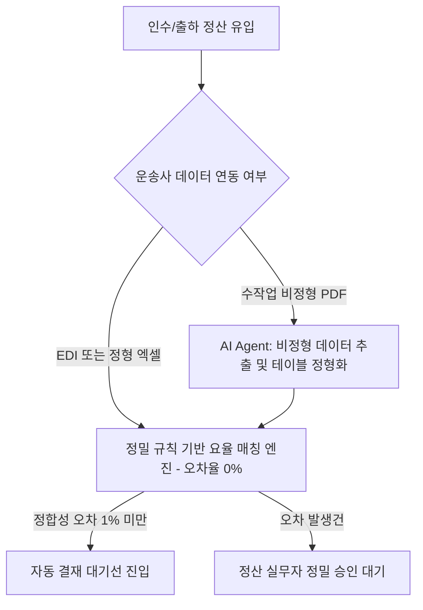

# 🚛 [타당성 검증] Dow Chemical 물류 인보이스 검증의 기술적 맹점과 하이브리드 대안

> **분석 및 검증자:** Gemini (Antigravity) 에이전트  
> **검증 대상 문서:** `Dow - Microsoft Copilot Freight Invoice Auditing Case Study`  
> **목적:** 수작업 송장 처리를 단 몇 분 만에 완수했다는 성과 뒤에 숨겨진 OCR/LLM 파싱의 기술적 오류율, 오탐 알람 폭탄의 실체를 해부하고 현실적인 대안을 세웁니다.

---

## 1. 피상적 홍보와 숨겨진 현실 (Marketing vs. Reality)

### 📢 솔루션사 홍보 자료 (Microsoft Customer Story)
> *"Dow는 매일 발생하는 4,000건의 글로벌 출하 인보이스 중 전자 데이터 연동이 안 되는 20%의 무작위 PDF 송장을 Copilot Studio 기반 에이전트로 48시간 만에 구축하여 단 수 분 만에 검증하고 연간 수백만 달러를 절감했습니다."*

### 🔍 Gemini의 냉정한 현실 검증 (Reality Check)
1. **'48시간 만에 구현'이라는 데모의 덫:**
   * 48시간 만에 만들어진 시스템은 정형화된 깨끗한 텍스트 PDF 몇 장을 대상으로 한 일회성 기술 데모(Mockup Demo)일 뿐입니다. 
   * 실제 현실의 글로벌 운송사, 통관사, 하역사들이 발송하는 PDF는 수백 가지가 넘는 서로 다른 문서 포맷과 레이아웃을 사용하며, 심지어 손글씨 서명이나 도장이 찍혀 뭉개진 스캔본 PDF인 경우가 허다합니다. 이 환경에서는 상용 OCR과 LLM의 글자 및 숫자 인식률이 급격히 추락합니다.
2. **소수점 하나가 가르는 대형 오정산 사고:**
   * 물류 인보이스는 소수점이나 화폐 단위(USD, EUR, KRW 등), 혹은 환율 계산 및 수량 가공에 따라 청구 금액 차이가 크게 벌어집니다. 
   * LLM은 계산 능력에 태생적 한계(Hallucination)가 있어 복잡한 가변 부대비용(Accessorial Fees) 요율을 정확히 산정하지 못합니다. 금액 오차가 조금만 생겨도 AI는 이를 모두 '비정상 청구'로 오류 판정하여 하루에 수백 건의 **노이즈 알람 폭탄(False Positive Alarm)**을 실무자에게 쏟아내게 되며, 결국 사람이 일일이 대조해야 하는 사후 이중 격무가 유발됩니다.
3. **규칙 기반 엔진과 LLM의 불필요한 이중 비용:**
   * 계약서에 정해진 요율 테이블과 실제 청구된 요율을 대조하는 작업은 정밀한 소스 코드(Rule-based System)가 가장 정확하게 수행합니다. 
   * 이를 굳이 비싸고 오작동 확률이 높은 거대 언어 모델(LLM)에 통째로 맡겨 비교하게 만드는 구조는 토큰당 API 비용 낭비는 물론, 신뢰할 수 없는 최종 출력값만 만들어냅니다.

---

## 2. 세아제강 도입 시 발생할 치명적 장벽 (Structural Obstacles)

만약 이 물류비 검증 모델을 세아제강 영업 및 구매 조달 파트에 이식하려 한다면 다음 현실적 제약에 부딪힙니다.

```text
[외부 운송사/관세사 PDF 인보이스 수신]
                 │
                 ▼
 ┌───────────────────────────────┐
 │   OCR / LLM 데이터 추출 단계  │ ◀─── 스캔 뭉개짐, 다국어 요율 기호 오인식 (오류율 10~20%)
 └───────────────────────────────┘
                 │
                 ▼
 ┌───────────────────────────────┐
 │  금액 정합성 단순 비교 엔진   │ ◀─── AI가 환율 및 가변 단가를 단순 오해하여 에러 처리
 └───────────────────────────────┘
                 │
                 ▼
 [하루 수십 건의 오탐지 알림 발생 ──▶ 실무진이 결국 알람 수신 거부 및 기존 수작업 엑셀로 복귀]
```

### ① 복잡한 국내외 가변 단가 체계
* 철강 제품의 출하 물류는 단순히 거리 대비 단가뿐 아니라, 중량별 요율 슬라이딩 스케일, 과적 및 혼적 부대비용, 야간/주말 할증, 유류할증료 등 고도로 세분화된 조건들이 얽혀 있습니다. 이 공식들이 제대로 소프트웨어화(Code-based)되어 있지 않다면 AI는 절대로 진짜 오버차지(Overcharge)를 가려낼 수 없습니다.

### ② 정서적 거부감과 수작업의 관성
* 정산 담당자가 AI가 걸러준 청구서만 믿고 결재를 올렸다가 만약 단 1건의 대형 정산 사고(공급사 결제 과다/과소 청구 누락)가 터지면, 모든 비난과 책임은 정산 담당자가 집니다. 따라서 담당자는 AI의 분석 결과와 상관없이 본인의 '수작업 정산용 엑셀 시트'를 끝까지 버리지 못하고 이중 정산을 지속하게 됩니다.

---

## 3. 세아제강을 위한 '진짜' 현실적 인보이스 자동화 대안 (Hybrid Model)

우리는 "AI가 모든 송장을 자동으로 검증한다"는 환상적인 무책임함을 버리고, **"정밀 룰 엔진 + 예외적 AI 문서 파싱"의 하이브리드 자동화 모델**을 대안으로 강력히 권장합니다.



1. **상위 5대 대형 파트너사 데이터 표준화 (Step 1):**
   * 세아제강 전체 물류/조달 청구 금액의 70% 이상을 차지하는 상위 대형 운송 파트너사들과는 PDF 송장 교환을 철저히 차단하고, **API 또는 정해진 규격의 엑셀 템플릿(정형 데이터)**으로만 거래 요율을 인입받아 기정형화된 룰 엔진으로 100% 정밀 무오류 검증합니다.
2. **소규모 수작업 PDF에 대해서만 보조적 AI 추출 (Step 2):**
   * 나머지 20~30%에 해당하는 가변적인 소규모 거래처의 비정형 PDF 송장에 한해서만 **AI PDF Extraction Agent**를 제한적으로 도입합니다. AI의 역할은 '요율 정합성 검증'이 아니라, 단순히 **"PDF 속의 표와 금액을 뜯어내서 정밀 룰 엔진이 읽을 수 있는 정형 테이블로 변환하는 것"**에 한정해야 합니다.
3. **책임 완화를 위한 '결재 승인 프로세스' 빌트인:**
   * AI의 데이터 추출에 신뢰도를 표기(Confidence Score: e.g., 98%)하고, 신뢰도가 95% 이상이면서 계약 금액 오차가 1% 미만인 청구서에 한해서만 담당자의 화면에 '원클릭 결재 승인' 대기 상태로 노출해 주어 실무진의 수작업 입력 피로도를 90% 이상 절감합니다.
