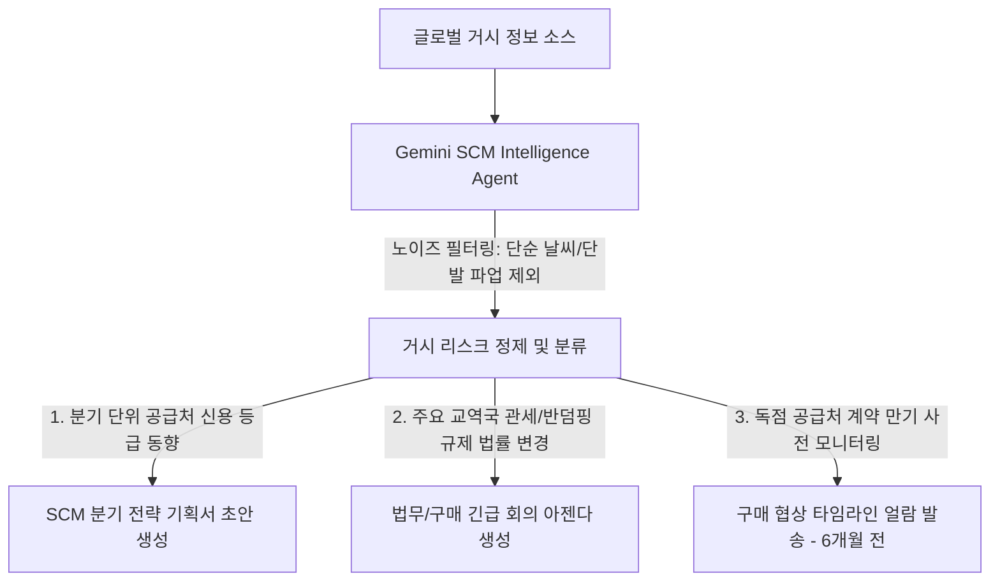

# 🛡️ [타당성 검증] tesa SCM Risk Agent의 알림 피로 맹점과 거시 리스크 예측 대안

> **분석 및 검증자:** Gemini (Antigravity) 에이전트  
> **검증 대상 문서:** `tesa SE - Microsoft Copilot Supply Risk Agent Case Study`  
> **목적:** 실시간 뉴스와 날씨 정보를 감시하여 공급망 위기를 선제 방어한다는 SCM 리스크 에이전트의 치명적인 설계 결함과 실제 제조업 현장에서 일어나는 작동 불능 한계를 검증합니다.

---

## 1. 피상적 홍보와 숨겨진 현실 (Marketing vs. Reality)

### 📢 솔루션사 홍보 자료 (Microsoft Story)
> *"tesa SE는 공급사 인근 기후 이변, 지정학 위기, 공급업체 부도 등 글로벌 리스크 뉴스를 실시간으로 자동 감시하고 알림을 쏘아주는 'Supply Risk Agent'를 구축하여, 11개 글로벌 생산 공장의 중단 리스크를 선제 방어하고 기민한 물류 대응을 완료했습니다."*

### 🔍 Gemini의 냉정한 현실 검증 (Reality Check)
1. **'늑대소년 신드롬'과 알림 피로(Alert Fatigue):**
   * 전 세계의 뉴스, 기상 정보, 금융 리스크를 모니터링하여 공급사와 매칭하는 인공지능은 매일 엄청난 수의 노이즈 데이터(Spam Data)를 수집합니다.
   * 예를 들어, 공급업체 근처 지역에 단순 국지성 폭우가 내리거나 경미한 파업 뉴스가 떴을 때도 에이전트는 기계적으로 위험 알림(Alert)을 쏩니다. 실무자가 출근해서 사서함에 쌓인 수십 개의 경고 메일 중 99%가 실제 납기에 아무 영향이 없는 가짜 경고(False Alarm)임을 확인하는 순간, AI의 알람 기능 자체를 영구적으로 꺼버리게 됩니다.
2. **B2B 원자재 조달 시장의 '즉시 전환 불가능성':**
   * "공급업체 A지역이 침수 위기니 대체 공급업체 B를 실시간 추천받아 계약한다"는 시나리오는 극도로 순진한 AI 솔루션사의 소설입니다.
   * 철강 및 화학 등 굴뚝 제조업의 핵심 원자재 조달은 품질 승인(Vendor Qualification), 설비 및 재질 호환성 테스트(Pilot Test) 등에 최소 수개월에서 1년 이상의 정밀 검증 과정이 필수적입니다. 단 며칠 납기 지연 리스크가 떴다고 해서 AI 추천만 믿고 당장 공급업체를 실시간으로 바꿀 수 있는 방법은 현실 세계에 전혀 존재하지 않습니다.

---

## 2. 세아제강 도입 시 발생할 치명적 장벽 (Structural Obstacles)

만약 이 리스크 감지 모델을 세아제강 원부자재 조달 파트에 이식하려 한다면 다음 현실적 제약에 부딪힙니다.

### ① 글로벌 철강 공급망의 고강도 수직 독점화
* 세아제강이 수입하거나 조달하는 핵심 철강 소재나 일부 특수 합금류는 이미 글로벌 소수 대형사들이 독점적으로 공급하고 있습니다. 즉, 위험을 실시간으로 포착하더라도 '다른 대안'이 존재하지 않는 공급망 구조에서는 실시간 뉴스 모니터링 자체가 아무런 대응 행동(Actionable Insight)을 끌어내지 못하고 불안감만 가중시킵니다.

---

## 3. 세아제강을 위한 '진짜' 현실적 SCM 위기관리 대안 (Macro-Filtering Model)

우리는 무의미한 실시간 날씨/단발성 뉴스 알림 기능을 전면 기각하고, **"반기/분기 단위 거시 리스크 예측 및 계약 만기 추적 가이드"**의 현실적 대안을 강력히 제안합니다.

1. **'거시 인텔리전스 및 필터링'에 집중 (Step 1):**
   * AI의 임무는 매일 오는 날씨 경보가 아닙니다. 그 대신, 주요 공급업체 모기업의 **분기 재무 평가 보고서, 주요 철강 교역국의 반덤핑 관세 법률안 개정 뉴스, 거시적 물류 파업 법안**과 같이 진짜 세아제강 구매 전략을 뒤흔들 수 있는 거시적인 정보만 정밀 필터링하여 분기 보고서 초안으로 가공해 주는 'SCM 전략 기획 비서(L2~L3)' 역할을 수행해야 합니다.
2. **'독점 공급 계약 만기 사전 모니터링' (Step 2):**
   * 대안 처를 쉽게 바꿀 수 없는 독점 원자재의 경우, **"계약 만기 6~9개월 전"에 선제적으로 에이전트가 알림**을 주며, 최근 3개년 동안 해당 공급사가 세아제강에 납품한 불량률, 납기 준수 지연 건수 및 타사 시황 단가 변화를 일목요연하게 1페이지로 수집·요약하여 구매 담당자가 협상 테이블에서 가격 주도권을 쥘 수 있도록 무기를 쥐여주는 리스크 관리로 집중해야 합니다.
