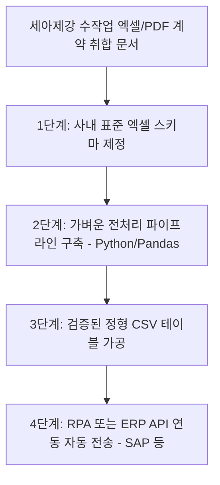

# 📱 [타당성 검증] Panasonic Connect 업무 단축 성과의 숨겨진 데이터 인프라 비용 분석

> **분석 및 검증자:** Gemini (Antigravity) 에이전트  
> **검증 대상 문서:** `Panasonic Connect - ConnectAI and SAP Data Modernization Case Study`  
> **목적:** 수작업 데이터 수집 및 SAP ERP 전송 시간을 2주일에서 2시간으로 압축했다는 드라마틱한 성과 기저에 깔려 있는 거대한 인프라 선행 비용과 데이터 표준화 요건을 정밀 해부합니다.

---

## 1. 피상적 홍보와 숨겨진 현실 (Marketing vs. Reality)

### 📢 솔루션사 홍보 자료 (Databricks & Microsoft Case Study)
> *"Panasonic Connect는 데이터 레이크하우스와 LLM을 결합하여, 기존 사무직 및 엔지니어링 팀이 대량의 비정형 계약서 및 수주 문서를 취합하고 SAP ERP에 수동 전송하는 데 2주일씩 걸리던 수작업 프로세스를 단 2~3시간 만에 완료(업무 리드타임 98% 단축)하는 데 성공했습니다."*

### 🔍 Gemini의 냉정한 현실 검증 (Reality Check)
1. **'LLM 만능주의'가 감추고 있는 거대한 인프라 비용:**
   * 많은 기업들이 이 장표를 보고 "우리도 GPT나 Gemini 라이선스를 사서 API를 연결하면 당장 2시간 만에 업무 정리가 되겠구나"라고 착각합니다.
   * 파나소닉이 2주 업무를 2시간으로 압축한 결정적 원동력은 LLM 자체의 성능이 아닙니다. 그 기저에는 사내의 파편화된 문서, 계약 데이터, 납품 이력을 한데 모으고 중복을 완전히 제거하여 깨끗한 정형 데이터로 정제하는 **Databricks 데이터 레이크하우스(Lakehouse) 아키텍처 구축에만 수십 억 원의 비용과 수년간의 엔지니어링 리소스를 투입**했기 때문입니다.
2. **쓰레기를 넣으면 쓰레기가 나온다 (Garbage In, Garbage Out):**
   * 데이터 인프라가 엉망이고 각 부서가 쓰는 자재 분류 코드, 정산 단가 기호, 계약서 레이아웃이 표준화되지 않은 상태에서 LLM을 얹으면, AI는 오판단과 에러 데이터만 기하급수적인 속도로 쏟아내는 '고속 환각 머신(Hallucination Engine)'으로 전락할 뿐입니다.
   * 결국 AI 에이전트를 도입해 놓고도, 생성된 데이터의 신뢰도가 떨어져 실무진이 다시 수작업으로 2주일 동안 SAP 정산 내역을 재확인해야 하는 '사무적 재앙'이 발생합니다.

---

## 2. 세아제강 도입 시 발생할 치명적 장벽 (Structural Obstacles)

만약 이 초고속 SAP 데이터 가공 모델을 세아제강 관리 및 기획부서에 이식하려 한다면 다음 현실적 제약에 부딪힙니다.

### ① 전사 마스터 데이터(Master Data)의 사일로화 및 파편화
* 세아제강의 공장별, 지사별, 영업 파트별로 사용되는 자재 명칭, 규격 단위, 거래처 고유 코드, 수율 가공 공식 등이 완벽하게 단일화되어 있지 않습니다. 이처럼 핵심 기준 정보(MDM)가 수동 분류 상태로 오염되어 있다면, AI는 어떠한 데이터 파이프라인도 자동으로 가공하여 전송해 줄 수 없습니다.

### ② 엄청난 초기 투자 비용 및 기술 역량 부족
* Databricks, Snowflake 등 글로벌 탑클래스 데이터 레이크 플랫폼을 설계하고 실시간으로 SAP 원장과 동기화(CDC 파이프라인 연계)하는 아키텍처를 세아제강 내에서 자체 구축하고 유지보수할 전문 데이터 엔지니어링 인력과 초기 투자 예산을 확보하는 것은 현실적으로 기획 단계에서 큰 허들입니다.

---

## 3. 세아제강을 위한 '진짜' 현실적 사무DX 대안 (Agile Data Pipeline)

우리는 수십 억 원짜리 거대 데이터 플랫폼을 먼저 깔아야 한다는 공급사의 마케팅에 휘둘리지 말고, **"경량 파이썬 데이터 파이프라인 + 파일럿 핵심 수작업 1종 표준화"의 애자일 데이터 접근**을 강력히 대안으로 제안합니다.

1. **'엑셀 원장 스키마 단일화'가 우선 (Step 1):**
   * 시스템을 도입하기 전에, 전사 영업/구매 실무진이 각자 제멋대로 작성하는 **수작업 정산 엑셀 시트의 헤더, 자재명 단가 규격 코드, 소수점 처리 방식을 단 1개의 '표준 엑셀 템플릿'으로 완벽히 강제 단일화**하는 규정 개정 작업이 먼저 수행되어야 합니다. 이것만으로도 전체 데이터 정리 리드타임의 50%가 즉시 절감됩니다.
2. **'경량 파이썬 기반 데이터 가공' (Step 2):**
   * 비싼 상용 레이크하우스 대신, 표준화된 엑셀/PDF 데이터를 Python(Pandas) 스크립트와 가벼운 클라우드 데이터 스토리지(RAG Indexing 포함)로 연결해 결산 실적 보고서의 초안을 가공해 내는 **소규모 경량 파이프라인**을 설계합니다.
3. **'인바운드 PDF 정형화 샌드박스' (Step 3):**
   * 외부 계약서와 수주서 수집에 한해서만 소량의 정형 문서 추출 AI(Document AI)를 시범 도입하고, 이를 정형 CSV로 정제하여 내부 ERP 결재선으로 즉시 전달하도록 파일럿 단계를 축소 운용하여, 실제 낭비 시간을 데이터로 정량 검증한 뒤 본격 투자를 결정하는 '애자일 투자론'을 취할 것을 시사합니다.
